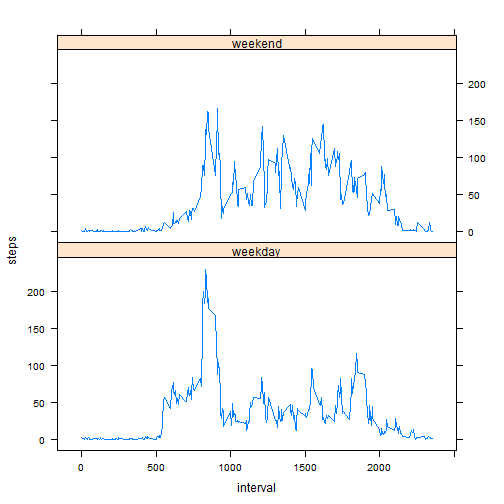

# Reproducible Research: Peer Assessment 1

This document contains the results of peer assessment 1 of the Reproducible Research course on Coursera.  

## Loading and preprocessing the data

The first step is to load the available data. It is assumed that the zip file with the raw data has been unzipped in the working directory of R.


```r
data <- read.csv("./activity.csv")
```

Convert the date into a real date object.  


```r
data$date <- as.Date(data$date)
```


## What is mean total number of steps taken per day?

Split the dataset by date and take the sum of the steps per day.    


```r
stepsPerDay <- sapply(split(data$steps, data$date), sum, na.rm = T)
hist(stepsPerDay, xlab = "Number of steps per day", main = "Histogram of steps per day", breaks = 10)
```

 

Calculate the mean and median number of steps per day. I decided to keep all days in the analysis also those with missing values.


```r
meanStepsPerDay <- mean(stepsPerDay)
medianStepsPerDay <- median(stepsPerDay)
```

The mean number of steps per day is:  

```r
sprintf("%f",meanStepsPerDay)
```

```
## [1] "9354.229508"
```
 
The median number of steps per day is:  

```r
sprintf("%f",medianStepsPerDay)
```

```
## [1] "10395.000000"
```

## What is the average daily activity pattern?

Split the dataset by interval and plot the average number of steps per interval.  


```r
meanStepsPerInterval <- sapply(split(data$steps, data$interval), mean, na.rm = T)
plot(names(meanStepsPerInterval), meanStepsPerInterval, type="l", xlab = "Interval", ylab = "Mean Steps Per Interval", main = "Plot of mean steps per interval")
```

 

The interval with the highest average number of steps is:  


```r
names(which.max(meanStepsPerInterval))
```

```
## [1] "835"
```


## Imputing missing values

The total number of missing values in the data set is:

```r
sum(is.na(data$steps))
```

```
## [1] 2304
```

Impute missing values by taking the average value of the interval.


```r
imputed <- data
for(i in which(is.na(imputed$steps))) {
    imputed$steps[i] <- meanStepsPerInterval[as.character(imputed$interval[i])]
}
```

Make an updated plot for the steps per day based on imputed data.  


```r
stepsPerDayImputed <- sapply(split(imputed$steps, imputed$date), sum, na.rm = T)
hist(stepsPerDayImputed, xlab = "Number of steps per day with imputation", main = "Histogram of steps per day", breaks = 10)
```

 

When you compare this plot with the earlier plot without imputation you can see that the number of days with total number of steps below 2000 has gone down from 10 to 2. Due to the imputation these days have now all moved to the 10000-12000 range in the histogram.  


Calculate the mean and median number of steps per day using the imputed data.


```r
meanStepsPerDayImputed <- mean(stepsPerDayImputed)
medianStepsPerDayImputed <- median(stepsPerDayImputed)
```

With imputation of missing values the mean number of steps per day is:   

```r
sprintf("%f",meanStepsPerDayImputed)
```

```
## [1] "10766.188679"
```
With imputation of missing values the median number of steps per day is:  

```r
sprintf("%f",medianStepsPerDayImputed)
```

```
## [1] "10766.188679"
```

With imputation of missing values the mean number of steps per day has gone up from:  

```r
sprintf("%f",meanStepsPerDay)
```

```
## [1] "9354.229508"
```

to:  

```r
sprintf("%f",meanStepsPerDayImputed)
```

```
## [1] "10766.188679"
```

Eight days in the data set were fully missing data: all intervals had NA for number of steps, these day have now been imputed with the average number of steps for all intervals. This means that these days of the data set are now turned into the average day of the data set. As a side effect of this the median and mean number of steps per day have become the same.  

## Are there differences in activity patterns between weekdays and weekends?

Create a new factor variable in the dataset with two levels - "weekday" and "weekend" indicating whether a given date is a weekday or weekend day.


```r
## Set the locale to English to make sure the day abbreviations show as English days
Sys.setlocale("LC_TIME", "English")
```

```
## [1] "English_United States.1252"
```

```r
imputed$weekday <- weekdays(imputed$date)
for (i in seq_along(imputed$weekday)) {
    if(imputed$weekday[i] == "Saturday" | imputed$weekday[i] == "Sunday") {
        imputed$weekday[i] = "weekend"
    } else {
        imputed$weekday[i] = "weekday"
    }
}
imputed$weekday <- as.factor(imputed$weekday)
```

First calculate the mean number of steps per interval for weekdays and for weekends. Then cleanup the column names of the new data.frame. Finally draw a panel plot containing a time series plot of the 5-minute interval  and the average number of steps taken, averaged across all weekday days or weekend days.    


```r
meanStepsPerIntervalWeekday <- aggregate(imputed$steps, list(imputed$weekday, imputed$interval), mean)
names(meanStepsPerIntervalWeekday) <- c("weekday", "interval", "steps")

library(lattice)
xyplot(steps ~ interval | weekday, data=meanStepsPerIntervalWeekday, type="l", layout=c(1,2))
```

 

In the plot you can observe that the activity pattern during the weekend is more constant while during the week there are higher peaks, particularly in the morning and in the evening, potentially caused by traveling to and from work.
